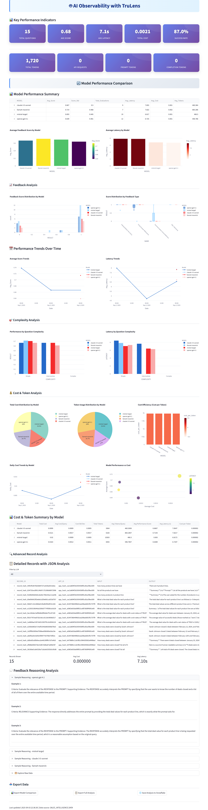

# AI Observability with TruLens and Snowflake

## What is TruLens?
TruLens is an open source library for evaluating and tracing LLM and RAG apps.
- Uses feedback functions and OpenTelemetry-style tracing.
- Measures quality, compares models, and logs metrics.
- Works with any LLM or agent workflow, including Snowflake Cortex AI.

## What is AI Observability?
AI Observability tracks, evaluates, and debugs AI and LLM pipelines to ensure reliability and trust.
- Collects metrics, traces, and evaluations for transparency and benchmarking.
- Surfaces problems like bias, hallucinations, and latency.
- Follows modern standards such as OpenTelemetry.

## TruLens and Snowflake
- Snowflake acquired core TruEra, the creators of TruLens, in May 2024.
- TruLens remains open source and self-hostable.
- Use TruLens alone or together with Snowflake’s LLM observability features.

## Sample Project Overview
This repo shows how to log and analyze LLM calls in Snowflake using TruLens with Cortex Analyst and Cortex Complete as examples.
- Metrics tracked: relevance, groundedness, accuracy, latency.
- Data lands in Snowflake tables for analysis and dashboards.
- Tables created and used:
  - `TRULENS_APPS`
  - `TRULENS_FEEDBACK_DEFS`
  - `TRULENS_FEEDBACKS`
  - `TRULENS_RECORDS`

## Setup
Create `.streamlit/secrets.toml` with your Snowflake connection and semantic model details:

```toml
[connections.snowflake]
host = "XXXXX.snowflakecomputing.com"
account = "XXXXXX"
user = "XXXXXX"
password = "XXXX-or PAT here"
role = "ACCOUNTADMIN"
warehouse = "XXXX"
database = "SALES_INTELLIGENCE"
schema = "DATA"
stage = "MODELS"
semantic_context_file = "sales_metrics_model.yaml"
client_session_keep_alive = true
pat = "XXXXXX"
```

## Run
1. First, create `.streamlit/secrets.toml` with your Snowflake connection details.  
2. Run `setup.sql` in your Snowflake account. This will:  
   - Create roles, database, schema, tables, and insert sample rows.  
   - Create the `MODELS` stage.  
3. Upload the provided `sales_metrics_model.yaml` file into the `MODELS` stage under the `sales_intelligence.data` schema.  
4. Install the required Python libraries (all packages used in the `import` statements).  
5. Start the chatbot app:  
   ```bash
   streamlit run streamlit-trulens-snowflake.py
   ```  
   - Interact with the chatbot using sales-related questions, for example:  
     - "How many deals were closed? List all"  
     - "What is the average deal value for deals with a win status of TRUE?"  
   - Select different models in the sidebar to compare responses and metrics.  
6. In another terminal, start the dashboard:  
   ```bash
   streamlit run streamlit-trulens-dashboard.py
   ```  
   - View metrics, evaluations, and comparisons across models.  
7. This project can also be run directly inside **Snowflake Streamlit (SiS)**.  

## How it works
- Decorate key functions with `@instrument` to emit traces and span attributes.
- Log inputs, outputs, timing, and errors for each step.
- Apply feedback functions to score relevance, groundedness, latency, cost, and other custom metrics.
- Query and visualize results in Streamlit or any BI tool connected to Snowflake.

## Why this helps
- **Transparency**. Inspect each step in your pipeline.
- **Quality**. Use feedbacks to enforce application-specific checks.
- **Benchmarking**. Compare models, prompts, and agents side-by-side.
- **Scale**. Store and analyze large volumes of traces securely in Snowflake.
- **Centralization**. Observe all LLM apps in one place.

## Dashboard



## Security note
Store secrets in Streamlit secrets or a vault, not in source control. Rotate PATs and credentials on a regular schedule.


## Additional Setup Notes
- Run `setup.sql` to create roles, database objects, sample tables, and a Cortex Search service for this demo.  
- Upload the provided `sales_metrics_model.yaml` file into the `MODELS` stage under `sales_intelligence.data` schema for Cortex Analyst setup.  


## Disclaimer
- This is my own version of a TruLens integration. There are other ways to use TruLens.  
- Check the official Snowflake documentation for the latest updates.  
This code is provided *as is*.  
